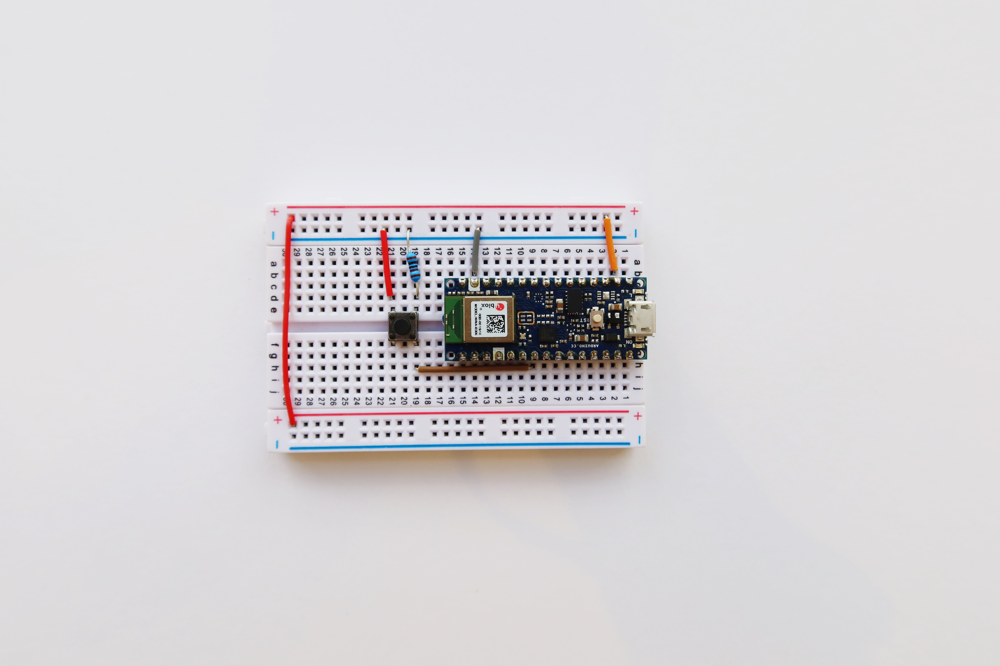
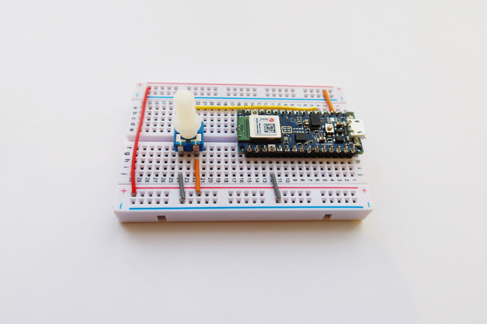

## Live Demo

<div class="example">
  <p>Read from one characteristic using p5.ble.js with callbacks</p>
  <div id="canvasContainer"></div>
</div>
<script src="https://cdnjs.cloudflare.com/ajax/libs/p5.js/0.7.2/p5.js"></script>
<script src="https://cdnjs.cloudflare.com/ajax/libs/p5.js/0.7.2/addons/p5.dom.min.js"></script>
<script src="https://unpkg.com/p5ble@0.0.4/dist/p5.ble.js" type="text/javascript"></script>
<script src="assets/scripts/example-read-one-char-callback.js"></script>

## Arduino Code
Arduino Code can be found [here](https://github.com/ITPNYU/p5.ble.js/tree/master/examples/readOneChar/arduino-sketches).

## p5 Code

```javascript
// The serviceUuid must match the serviceUuid of the device you would like to connect
const serviceUuid = "19b10010-e8f2-537e-4f6c-d104768a1214";
let myCharacteristic;
let myValue = 0;
let myBLE;

function setup() {
  colorMode(HSB, 255);
  // Create a p5ble class
  myBLE = new p5ble();

  createCanvas(200, 200);
  textSize(20);
  textAlign(CENTER, CENTER);

  // Create a 'Connect' button
  const connectButton = createButton('Connect')
  connectButton.mousePressed(connectToBle);
}

function connectToBle() {
  // Connect to a device by passing the service UUID
  myBLE.connect(serviceUuid, gotCharacteristics);
}

// A function that will be called once got characteristics
function gotCharacteristics(error, characteristics) {
  if (error) console.log('error: ', error);
  console.log('characteristics: ', characteristics);
  myCharacteristic = characteristics[0];
  // Read the value of the first characteristic
  myBLE.read(myCharacteristic, gotValue);
}

// A function that will be called once got values
function gotValue(error, value) {
  if (error) console.log('error: ', error);
  console.log('value: ', value);
  myValue = value;
  // After getting a value, call p5ble.read() again to get the value again
  myBLE.read(myCharacteristic, gotValue);
  // You can also pass in the dataType
  // Options: 'unit8', 'uint16', 'uint32', 'int8', 'int16', 'int32', 'float32', 'float64', 'string'
  // myBLE.read(myCharacteristic, 'string', gotValue);
}

function draw() {
  if(myValue || myValue === 0){
    background(myValue, 255, 255);
    // Write value on the canvas
    text(myValue, 100, 100);
  }
}
```

## [p5 Code Source](https://github.com/ITPNYU/p5.ble.js/tree/master/examples/readOneChar/p5-sketch/callback)

## Demo Video
#### 1. Read button value from Arduino Nano 33 BLE  board in a p5 sketch:


Circuit board for Arduino Nano 33 BLE with a button:


#### 2. Read potentiometer value from Arduino Nano 33 BLE  board in a p5 sketch:


Circuit board for Arduino Nano 33 BLE with a potentiometer::


## Try it in p5 Web Editor
- [Read one Characteristic - Button](https://editor.p5js.org/jingwen_zhu/sketches/RLGXVkEN_)
- [Read one Characteristic - Potentiometer](https://editor.p5js.org/jingwen_zhu/sketches/-sjh-ZLSS)
